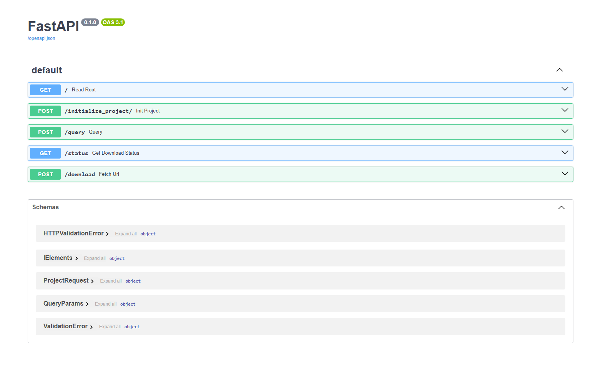

# 📦 Downloader Tool - HoloBuilder Project Asset Manager

This project is a Python-based CLI tool designed to initialize, query, and download data from cloud server of FARO sensor using HoloBuilder projects API. It provides:

- 🌐 A FastAPI based server for project initialization, querying, and download tracking along with the implementation of Swagger UI for API docs.
- 🖥️ A CLI interface for intializing Project and executing custom SQL queries via cmd to Fetch data from db.
- 🧠 A SQLite-based local metadata store using SQLModel. 

---

## 🛠 Project Components

### 1. FastAPI Server

- Initializes projects by calling the HoloBuilder API.
- Caches `iElements` metadata into a local SQLite DB.
- Exposes endpoints to query metadata and download assets.
- Tracks download status via `/status`.

### 2. CLI Tool (using Click)

- Executes raw SQL queries on the local database.
- Useful for debugging or batch operations.
- Can be used interactively or as part of automated scripts.

### 3. SQLite Database

- Created automatically on initialization.
- Contains all `iElements` from a given HoloBuilder project.

---

## 🚀 Getting Started

### 📦 Step 1: Build the Docker Image

Navigate to the root directory of the project and build the Docker containers:

### ✅ Step 1: Build Docker image using docker compose

**Functionality**:  
Build Docker Image.

```bash
docker-compose build
```
---
### ✅ Step 2: Run the following commads to test cli tool: 

**Functionality**:  
To run the cli as tool.

```bash
docker-compose run cli downloader project_id <project_id>
```

```bash
docker-compose run cli downloader query <Query>
```

### ✅ Step 3: Run the following commads to download all the data from URLs present in the database: 

```bash
docker-compose run cli downloader download-all
```

### ✅ Step 4: To interect with web server using API.

```bash
docker compose up api
```

### ✅ Step 5: To install the tool locally.

```bash
pip install .
```
---
<p align="center">
  
</p>
---